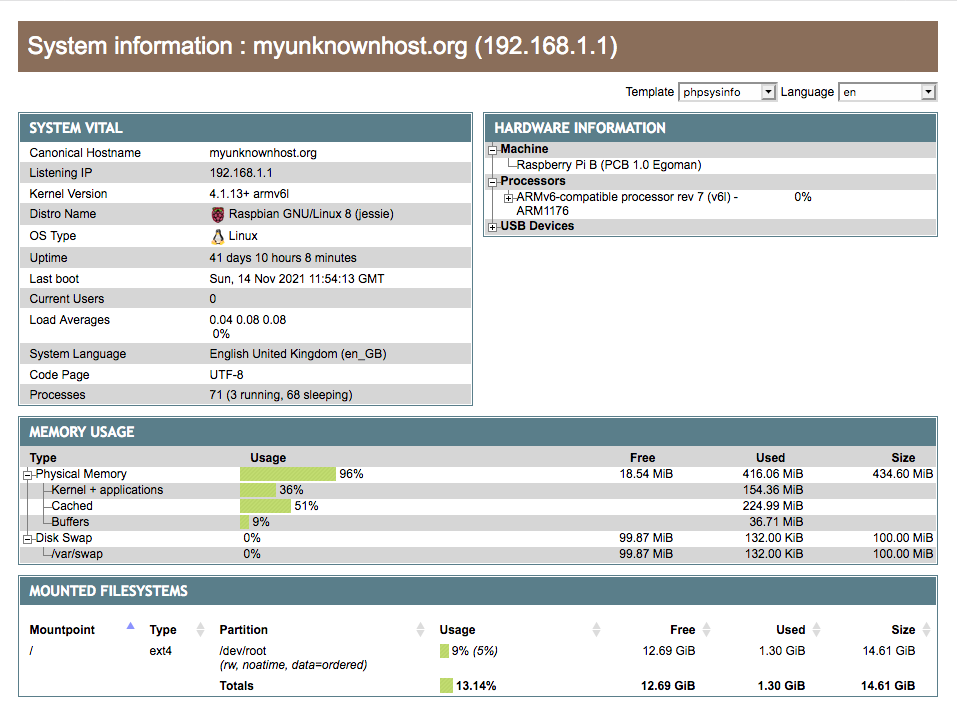

<!--
N.B.: This README was automatically generated by https://github.com/YunoHost/apps/tree/master/tools/README-generator
It shall NOT be edited by hand.
-->

# PhpSysInfo for YunoHost

[](https://dash.yunohost.org/appci/app/phpsysinfo)    
[](https://install-app.yunohost.org/?app=phpsysinfo)

*[Lire ce readme en français.](./README_fr.md)*

> *This package allows you to install PhpSysInfo quickly and simply on a YunoHost server.
If you don't have YunoHost, please consult [the guide](https://yunohost.org/#/install) to learn how to install it.*

## Overview

A customizable PHP script that displays information about your system nicely.


**Shipped version:** 3.4.1~ynh1


**Demo:** http://phpsysinfo.sourceforge.net/multi/index.php?disp=bootstrap&xml=raspbian

## Screenshots



## Disclaimers / important information

## Configuration

Edit `phpsysinfo.ini` in `/var/www/YOURPATH/phpsysinfo.ini`.

## Documentation and resources

* Official app website: <https://phpsysinfo.github.io/phpsysinfo/>
* Official admin documentation: <https://phpsysinfo.github.io/phpsysinfo/>
* Upstream app code repository: <https://github.com/phpsysinfo/phpsysinfo/>
* YunoHost documentation for this app: <https://yunohost.org/app_phpsysinfo>
* Report a bug: <https://github.com/YunoHost-Apps/phpsysinfo_ynh/issues>

## Developer info

Please send your pull request to the [testing branch](https://github.com/YunoHost-Apps/phpsysinfo_ynh/tree/testing).

To try the testing branch, please proceed like that.

``` bash
sudo yunohost app install https://github.com/YunoHost-Apps/phpsysinfo_ynh/tree/testing --debug
or
sudo yunohost app upgrade phpsysinfo -u https://github.com/YunoHost-Apps/phpsysinfo_ynh/tree/testing --debug
```

**More info regarding app packaging:** <https://yunohost.org/packaging_apps>
